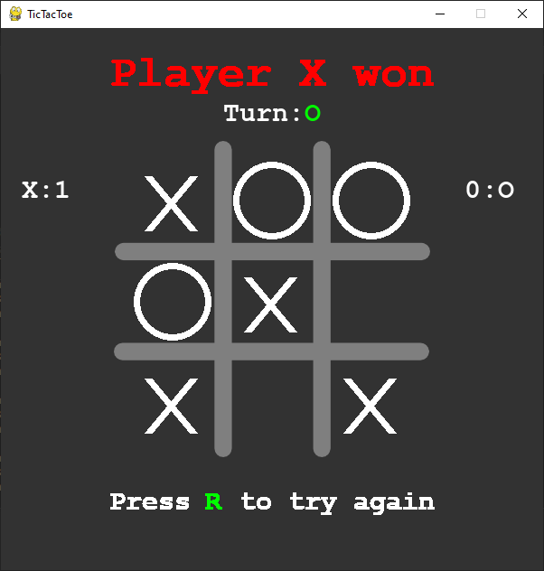

# Tic Tac Toe
This game is made using only the PyGame framework.  

The whole game is written in one file containing something less than 250 lines.



To run the game clone the repo and run  

```
python -m pip install -r requirements.txt 
python tictactoe.py
```
  
or if you have python 2 installed too  
```
python3 -m pip install -r requirements.txt 
python3 tictactoe.py
```